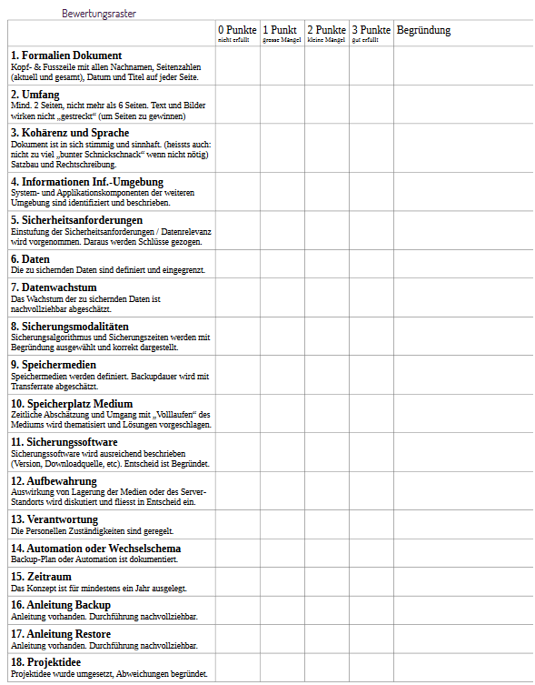

****

## Kriterien:

****

## To-do

- [x] Kopf-Fusszeile (Sean)
- [ ] Format (Sean)
- [x] Umgebung identifizieren und beschreiben (system und applikationskomponenten) Elis
- [x] Sicherheisanforderungen (Elis)
- [x] Daten (Zu sichernde daten identifizieren) (jamie)
- [x] Datenwachstum abschätzen (Alex)
- [x] Sicherungsalgorithmus und zeiden (auswahl und begründung) (Alex)
- [x] Speichermedien definieren
- [x] Siehe Kriterium 10
- [x] Sicherungssoftware (eue RSYNC)
- [ ] Aufbewahrung
- [ ] Verantwortung
- [ ] Automation
- [ ] Zeitraum
- [ ] Anleitung backup&restore
- [ ] Abweichung projektidee begründen
- [x] Mitm Hung ga loufe (Sean)